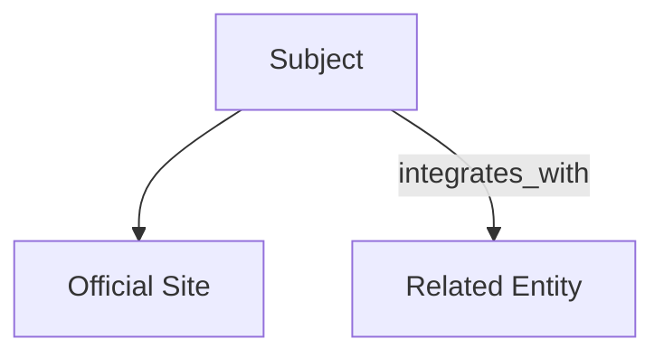

# Output

Return a compact answer with sources plus normalized structure.

## Default Output

### Search Result

- `Name:`
- `Search mode:`
- `Schema type:`
- `Summary:`
- `Official website:`
- `Schema record:`
- `Action record:`
- `Key details:`
- `Knowledge graph:`
- `Resolution result:`
- `Recent status:`
- `Sort/filter attributes:`
- `Important data points:`
- `Employment/life signals:`
- `Caveats:`
- `Sources:`

When running in `deep research` mode, prefer:

- more source coverage
- stronger corroboration
- fuller important data points
- richer schema record
- denser knowledge graph
- optional trace output

When running in `sherlock deduction` mode, also include:

- `deduction_mode`
- `hypotheses`
- `inferred_links`
- `missing_links`
- `trace`

When running in `graph traversal` mode, also include:

- `hop_distance`
- `discovery_path`
- `path_strength`
- `related_nodes`

When running in `crawl everything` mode, also include:

- `crawl_summary`
- `frontier_state`
- `checkpoint`
- `visited_nodes`
- `excluded_nodes`
- `dedupe_summary`

When the workflow needs downstream propagation, also include:

- `alert_payload`
- `delivery_mode`
- `alert_threshold_reason`

When running multi-timeline or correlation analysis, also include:

- `timeline`
- `event_sequence`
- `state_transitions`
- `correlations`
- `aligned_entities`
- `aligned_locations`
- `aligned_time_window`

When running cause or impact analysis, also include:

- `cause_event`
- `effect_event`
- `intermediate_events`
- `causal_chain`
- `causal_confidence`
- `causal_evidence`

## Schema Record

Use a compact structured object when normalization helps:

```json
{
  "schema_type": "Organization",
  "name": "Example",
  "industries": ["software", "saas"],
  "relations": [
    {"type": "integrates_with", "target": "Slack"}
  ],
  "profiles": [
    {"platform": "LinkedIn", "url": "https://example.com"}
  ]
}
```

Include normalized attributes only when supported by evidence.

If the user wants storage-ready output, make the schema record compatible with the SurrealDB model in [surrealdb.md](surrealdb.md).

## Action Record

When the result depends on who did what, when, where, or to whom, include a structured action record:

```json
{
  "actor": "Person or organization",
  "action_type": "posted",
  "object": "public statement",
  "target": "named person or organization",
  "time": "2026-04-07T10:30:00Z",
  "location": "Bangalore, India",
  "source": "https://example.com/post",
  "source_tier": 3,
  "confidence": "medium",
  "status": "reported_publicly"
}
```

Use this when the user cares about:

- who did it
- what they did
- when they did it
- where they did it
- upon whom or what they acted

If the important finding is an observed lack of response or lack of activity, represent it explicitly as a non-action rather than omitting it:

```json
{
  "actor": "thing:subject_1",
  "action_type": "non_action",
  "non_action": true,
  "non_action_type": "no_response",
  "expected_action": "reply_to_notice",
  "absence_window": "2026-04-01/2026-04-07",
  "confidence": "medium",
  "status": "observed_absence"
}
```

Use this for cases such as no reply, no acknowledgement, no login, no update, no workflow progress, or other source-backed absence.

If any field is unsupported, omit it instead of guessing.

When the evidence comes from audit, access, network, transaction, or workflow logs, extend the record with fields such as:

```json
{
  "log_source": "okta_system_log",
  "event_id": "evt_123",
  "event_type": "workflow_failed",
  "session_id": "sess_456",
  "request_path": "/api/v1/apps",
  "ip_address": "203.0.113.10",
  "network": "corp_vpn",
  "status_code": 403,
  "outcome": "denied",
  "ingested_at": "2026-04-07T13:00:00Z"
}
```

Treat log records as structured observed events. Keep them separate from later narrative interpretation.

When the evidence comes from personal chats or direct messages supplied by the user or an authorized source, preserve message context in a compact structure such as:

```json
{
  "message_source_type": "direct_message",
  "speaker": "thing:person_1",
  "target": "thing:person_2",
  "message_id": "msg_123",
  "conversation_id": "conv_456",
  "time": "2026-04-07T10:30:00Z",
  "reported_impact": "reported_psychological_impact",
  "status": "reported_publicly"
}
```

Treat chat evidence as sensitive, attributable message-level evidence. Do not convert it into stronger psychological, medical, or legal conclusions unless corroborated.

When location or time matters, include attributes such as:

```json
{
  "location": "Bangalore, Karnataka, India",
  "distance_km": 2.4,
  "published_at": "2026-04-07",
  "event_time": "2026-04-06T20:30:00+05:30",
  "rating": 4.3,
  "review_count": 182
}
```

Treat `time` and `location` as primary output attributes, not optional decoration, whenever they affect verification, ranking, filtering, or action interpretation.

When ranking matters, include attributes such as:

```json
{
  "relevancy": 0.93,
  "recency": 0.81,
  "contextuality": 0.88,
  "source_tier": 2,
  "trust_score": 0.86
}
```

Use these to explain why one source, match, or candidate was ranked above another.

When movement or travel matters, extend the record with:

```json
{
  "origin": "Koramangala, Bangalore",
  "destination": "MG Road, Bangalore",
  "journey_path": ["Koramangala", "Indiranagar", "MG Road"],
  "mode_of_transport": "car",
  "departure_time": "2026-04-07T08:10:00+05:30",
  "arrival_time": "2026-04-07T08:52:00+05:30"
}
```

Include journey path and transport mode only when they are directly supported or clearly marked as estimated.

For multi-person, multi-timeline, multi-event analysis, include compact structures such as:

```json
{
  "timeline": [
    {"entity": "thing:person_1", "time": "2026-04-01T09:00:00Z", "event": "promotion"},
    {"entity": "thing:person_2", "time": "2026-04-03T11:00:00Z", "event": "joined_company"}
  ],
  "correlations": [
    {
      "entities": ["thing:person_1", "thing:person_2"],
      "pattern_type": "temporal_cluster",
      "correlation_score": 0.78,
      "aligned_time_window": "2026-04-01 to 2026-04-05",
      "aligned_locations": ["Bangalore", "Mumbai"]
    }
  ]
}
```

Use this when the user wants to compare many entities, timelines, or events together.

For cause-and-impact questions, include a compact causal structure such as:

```json
{
  "cause_event": "loan_not_disbursed",
  "effect_event": "school_fees_unpaid",
  "intermediate_events": ["cash_shortfall", "payment_failed"],
  "causal_chain": [
    {"event": "loan_not_disbursed", "time": "2026-03-28"},
    {"event": "cash_shortfall", "time": "2026-03-30"},
    {"event": "payment_failed", "time": "2026-04-02"},
    {"event": "school_fees_unpaid", "time": "2026-04-03"}
  ],
  "causal_link_type": "payment_dependency",
  "causal_confidence": "medium",
  "causal_evidence": [
    "Loan status remained not disbursed before the fee due date",
    "No alternate payment source was observed in the supplied records"
  ]
}
```

Use this when the user asks why a downstream event happened or how one event affected another.

## Resolution Result

When the task is named entity resolution, identity fabric, duplicate-account removal, or enrichment, include:

```json
{
  "resolution": "matched | possible_duplicate | distinct | unresolved",
  "confidence": "high | medium | low",
  "evidence": [
    "Same official domain",
    "Verified profile linked from employer page"
  ],
  "recommended_action": "merge | review | keep_separate | enrich_only"
}
```

Use `merge` only when the evidence is strong enough to justify it.

## Alert Payload

When the task requires propagation of a critical or operationally important finding, include a compact outbound payload:

```json
{
  "alert_id": "alert:001",
  "alert_type": "critical_finding",
  "delivery_mode": "webhook",
  "severity": "high",
  "title": "High-confidence public incident detected",
  "entity": "thing:example",
  "summary": "Two high-trust sources reported a recent regulatory action affecting the entity.",
  "source_of_information": ["official_notice", "news_coverage"],
  "trust_score": 0.92,
  "confidence": "high",
  "relevancy": 0.94,
  "recency": 0.88,
  "contextuality": 0.83,
  "time": "2026-04-07T12:30:00Z",
  "location": "India",
  "recommended_action": "review_immediately",
  "source_links": ["https://example.com/notice"]
}
```

Use `delivery_mode` as `webhook` or `api`.

## Sherlock Deduction Output

When the user explicitly asks for deeper dot-connecting beyond obvious links, include a compact deduction block such as:

```json
{
  "deduction_mode": "sherlock_deduction",
  "hypotheses": [
    {
      "hypothesis": "The two accounts belong to the same operator through a shared support workflow",
      "status": "plausible",
      "confidence": "medium"
    }
  ],
  "inferred_links": [
    {
      "from": "thing:account_a",
      "to": "thing:account_b",
      "relation": "likely_operated_with",
      "basis": ["shared recovery email domain", "matching support escalation path"],
      "confidence": "medium"
    }
  ],
  "missing_links": [
    "No direct provider-managed identifier was found"
  ]
}
```

Use this mode only when explicitly requested, and keep all inferred links separate from verified facts.

## Important Data Points

When the task involves trust, fraud, accidents, bans, or public incidents, surface structured metrics such as:

```json
{
  "incident_type": "ban",
  "incident_count": 3,
  "latest_incident_date": "2026-03-18",
  "affected_platform": "Instagram",
  "affected_region": "India",
  "risk_signal": "platform_notice"
}
```

Use these as public signals for ranking, filtering, and review, not as standalone proof.

## Employment/Life Signals

When the task involves a person’s current status or trust context, include structured public milestone signals such as:

```json
{
  "employment_signal": "promotion",
  "life_event_signal": "relocation",
  "status": "social_only",
  "published_at": "2026-04-07",
  "source_of_information": "LinkedIn",
  "trust_score": 0.68
}
```

Use these signals to enrich profiles and ranking. If they are social-only, mark them clearly instead of upgrading them to verified facts.

## Source Handling

When a source is low trust or socially sourced:

- label it as `claim`, `signal`, or `allegation`, not `fact`
- include source tier when that helps downstream review
- prefer corroborating evidence before using it in deduplication, verification, or trust conclusions
- exclude low-trust sources from merge decisions unless stronger evidence supports them
- keep public incident and ban signals distinct from verified legal or regulatory findings
- keep employment and life-event signals distinct from formally verified records unless corroborated

## Knowledge Graph

Render Mermaid when the subject has meaningful linked entities.



Use explicit relation labels from `taxonomy.md`.

For action-heavy queries, connect the `actor` to the `action`, then to the `target`, `location`, `time`, and `source`.

For traversal-heavy queries, include path-aware graph context such as:

```json
{
  "related_nodes": [
    {
      "node": "thing:partner_1",
      "hop_distance": 2,
      "discovery_path": ["thing:seed", "thing:customer_1", "thing:partner_1"],
      "path_strength": 0.74
    }
  ]
}
```

Use this to show how distant nodes were discovered and why they were kept.

For exhaustive crawl mode, include a compact crawl summary such as:

```json
{
  "crawl_summary": {
    "visited_nodes": 428,
    "kept_nodes": 119,
    "excluded_nodes": 309,
    "max_depth_reached": 4,
    "checkpoint": "crawl_checkpoint_2026_04_07_01"
  }
}
```

Keep exhaustive results navigable: summarize the graph, then provide the highest-value nodes first.

## SurrealDB Export

When the user wants persistence, return records in a directly loadable shape:

- `thing`
- `action`
- `source`
- `relation`

Use string record references such as `thing:okta` or `source:post_1` when useful.

## Quality Rules

- Include concrete dates for current or recent facts.
- Separate verified facts from inferences.
- Omit unsupported fields instead of guessing.
- Use enough source links for the user to audit the main claims quickly.
- For deduplication or identity matching, prefer explicit confidence and evidence over false certainty.
- For socially sourced claims, distinguish between `reported publicly` and `verified`.
- When sorting or filtering results, explain which attributes drove the ranking if that affects the outcome.
- For action records, separate observed actions from inferred motives or conclusions.
- When ranking is central, explain the balance between `relevancy`, `recency`, `contextuality`, and `trust_score`.
- For timeseries and correlation results, distinguish clearly between sequence evidence, co-occurrence, and causation.
- For traversal results, distinguish direct neighbors from distant nodes and preserve the discovery path.
- For exhaustive crawl results, preserve budgets, checkpoint state, and dedupe decisions so the crawl can be reviewed or resumed.
- For fraud, accident, ban, or complaint signals, distinguish clearly between `official action`, `reported incident`, `platform action`, and `public allegation`.
- For employment or life-event signals, distinguish clearly between `officially_confirmed`, `reported_publicly`, and `social_only`.
